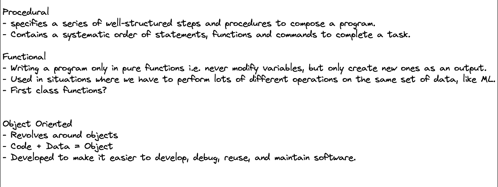

# **Lecture 1**

**Types of Languages:**

* Procedural
* Functional
* Object Oriented

**First class functions:**  
The functions which treated as any other variable. For example:  
      *In such a language, a function can be passed as an argument to other functions, can be returned by another function and can be assigned as a value to a variable.*

Object:   
Single custom data type which named group of properties.

Static vs Dynamic Languages: At the time of compilation, when we know what type of data that we are storing in our program is called static language.

At the time of compilation if the compiler don't know what type of data that user wants to store is called dynamic language.

> int a=10 ---> Static language   
> a=10 ---> Dynamic language

Quick Quiz

Is this give us an error?
> a=10  
> a="Khushi"

Not give an error, cause it will modify the variable object for reference

> a=10  

a store in stack called as reference, pointing to the 10 which is an object store in heap

> a = [1,2,3,4]  
> b = a  
> a[0]=99  
> print(b)  
output: [99,2,3,4] --> will change the value cause both are the reference to the same object

When we don't have any reference to your object then it hits by a garbage collector and gets removed from the memory called garbage value

