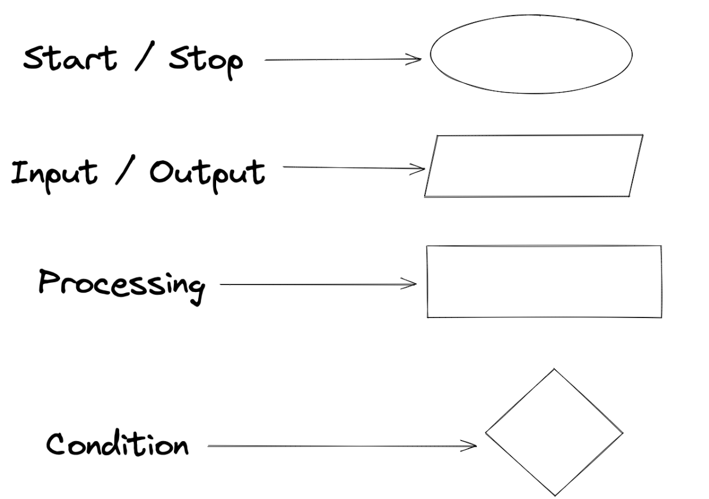
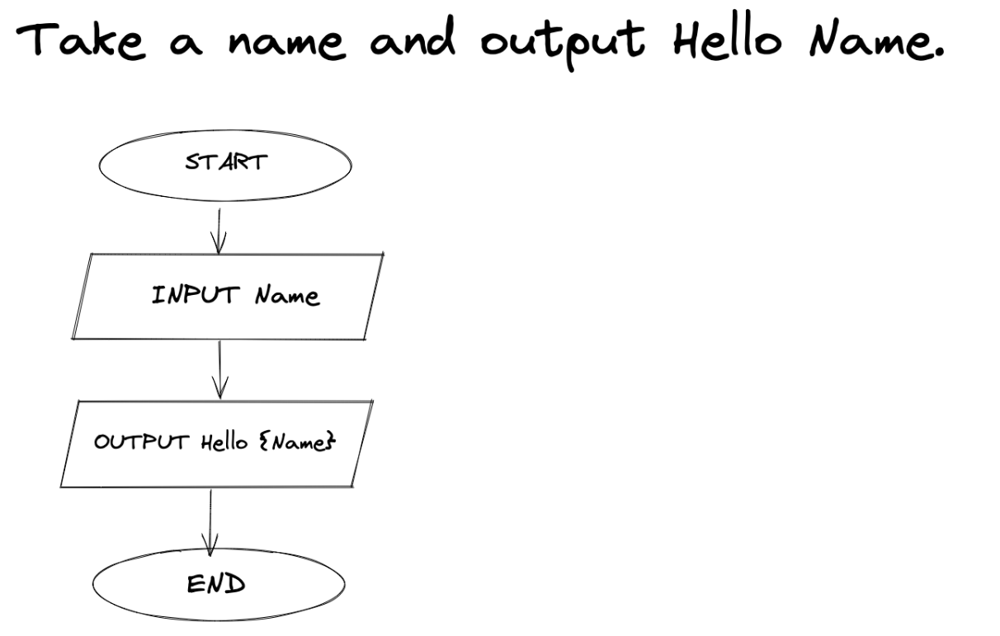
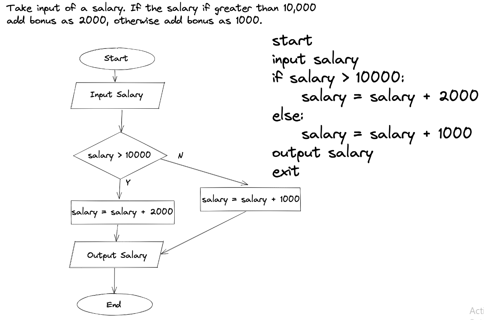
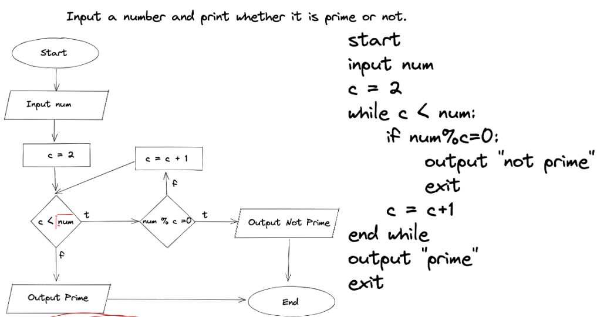
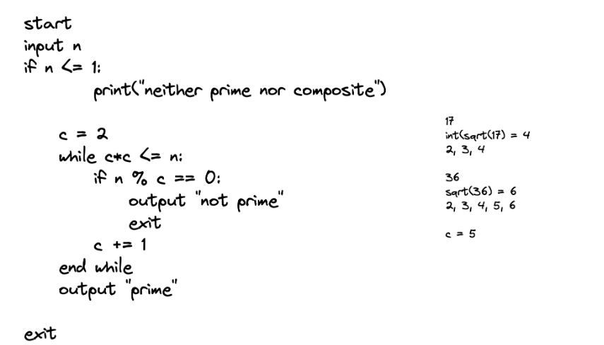

# **Lecture 2**

Flowcharts:

The flow of program with the help of a chart. 

1. Flowchart for Printing Hello world

2. Flowchart for salary-bonus program

3. Flowchart and pseudocode for checking whether the number is prime or not.

4. Optimized program for checking prime number

