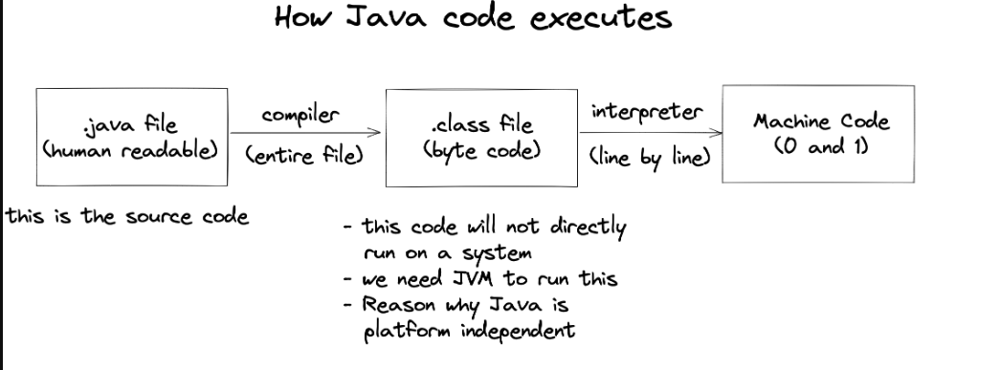
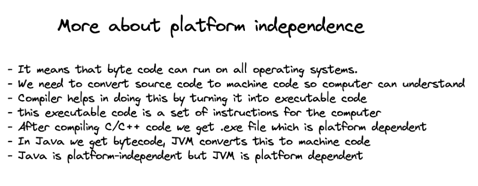
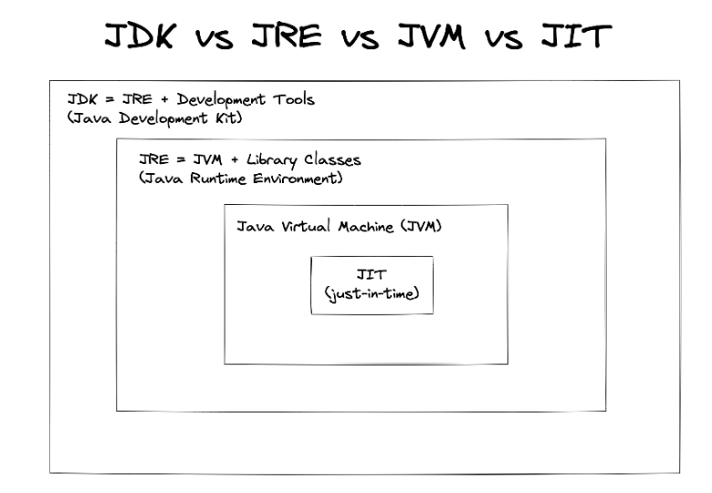
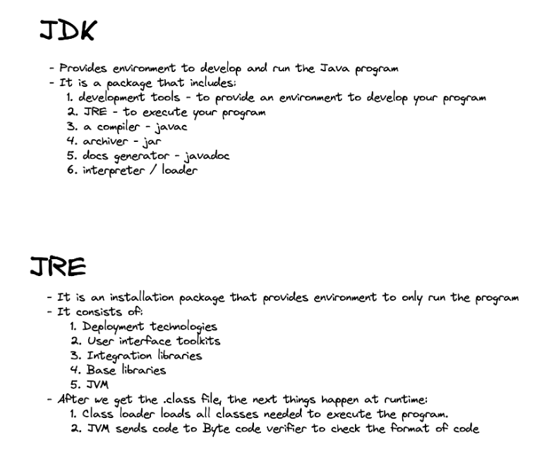
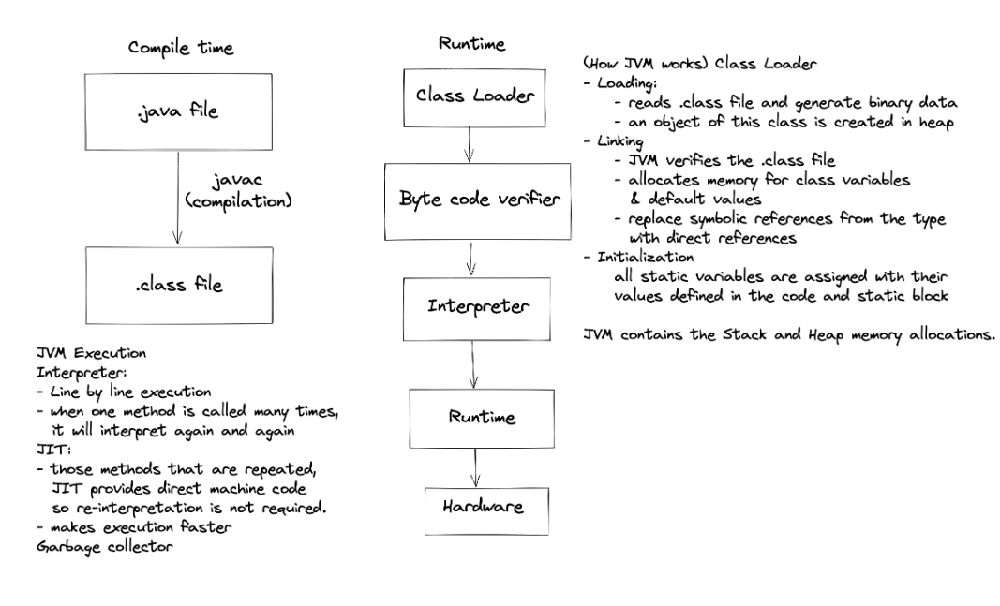
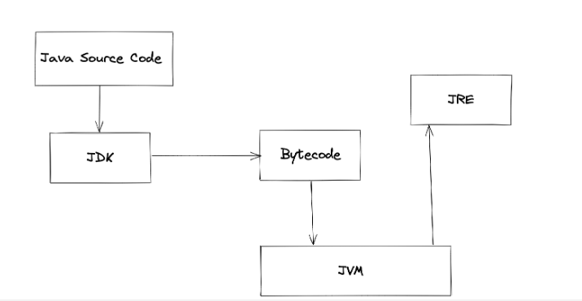

# **Lecture 3**

## How java code executes?
In C, C++ source code converts into the machine code with the help of compiler and it would be machine dependent, It has to be executed everytime with the help of compiler on different machines

But in case of Java, compiler first convert the source code into an exceutable code which is error free code, also called as "Byte code" which is platform independent and can run on mutiple operating systems with the help of JVM (java virtual machine) and then this executable code can be run with the help of an interpretor 

## Why java is platform independent?

## JDK vs JRE vs JVM vs JIT ?

Note : JIT :(Java In time) When we have a piece of code which is used at multiple locations in our program then interpretor needs to convert those lines everytime into the machine code, Thus in order to prevent it from this, we use (java in time)
that directly provides the machine code to the interpretor

Components: JDK and JRE

