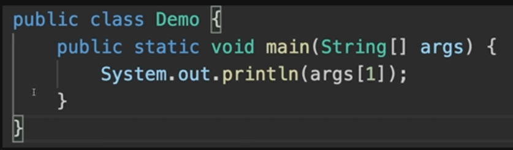

# **Lecture 4**

Class should start with capital letter, this is consider as a good practice

Without main function our program can never be executed, It is the entry point of our program

Static functions: Which do not requires to create an object. It is same for all the objects
Example: Population is the property for all the objects say people of class humans, thus it is static

Commands:
* For converting souce code into an executable code: 
>javac name_of_file
* For converting executable code into machine code: 
> java name_of_file

* To store the byte code in different directory
> javac -d .. name_of_file (stores in previous directory)

Note: we can change the name of our class, not neccessary to have same name as filename but we can't make it public,
If we want to make it public then have same name as class 

1. Class name should be same as file name
2. public is an access modifier which gives the accessibility of main program anywhere in the environment
3. execution starts from the main function and if it was not there then there would be no
execution
4. static functions are those which don't require to create an object and will be same for all the
objects created 
5. string[] takes parameters from the command lines and they gonna store in the string array itself.
6. system is a class, out is a reference to Printstream class and println is a function which is present in this class
7. args[1], we can access our command line inputs via index

Packages: 
* Accessibility to the files
* Layer protection
* Folder that seperates with the other package(folder where java files are stored)

Input from the user:   
Scanner class which provides the input functions, so we can use it by creating an object.

Primitive Data types:- Which cannot be further down into other data types
Example: String can be further down into characters thus it is not a primitive data types

But integer is one of the primitive data types

Others are:  
* int
* float
* boolean
* char
* long
* double

Typecasting: 
* Implicit
* Explicit

Implicit: Automatically done by compiler, when we want to store small values in large data type   
Explicit: Explicitly done by type casting when small container wants to store large values

Automatic type promotion in expressions:

It automatic converts the type of the result into the variable type followed by the data type

*Java follows unicode(same as language, it'll print) principles.*

