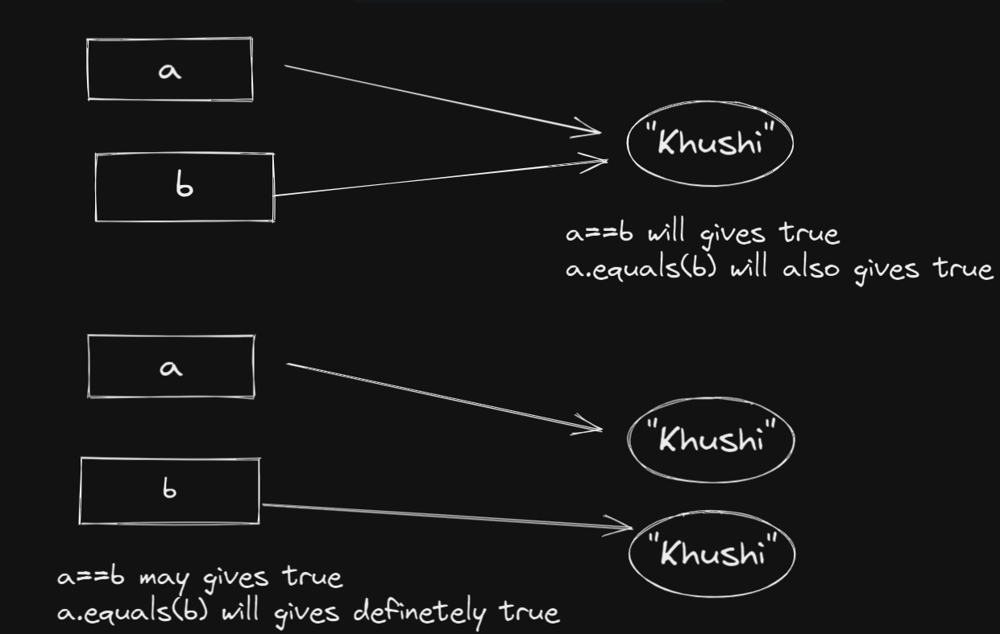
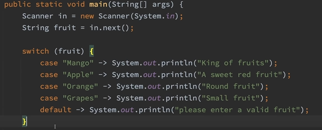
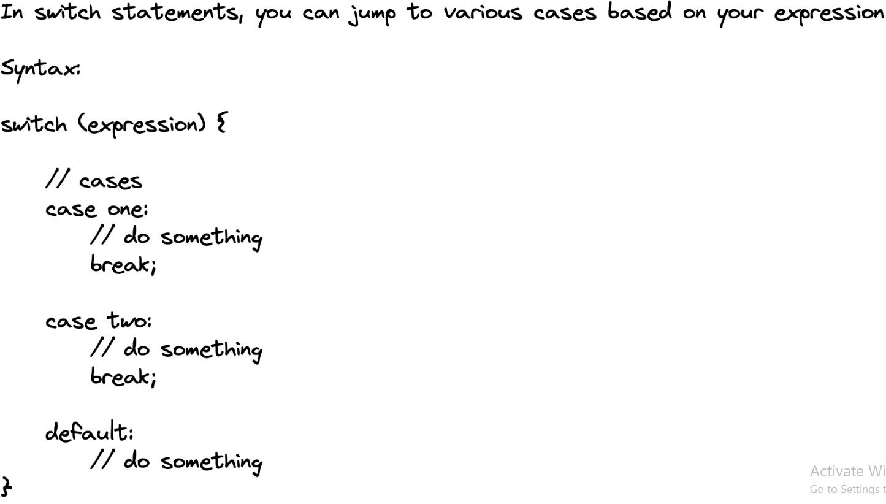

# **Lecture 6**

Switch cases:  
Multiple conditions can be checked, same as if else if conditional statements

Difference between == and equals:

1. ==: Checks the reference of an object if they are same then it gives true

2. equals: Checks the value not reference

Enhanced switch:

Syntax of switch case:

