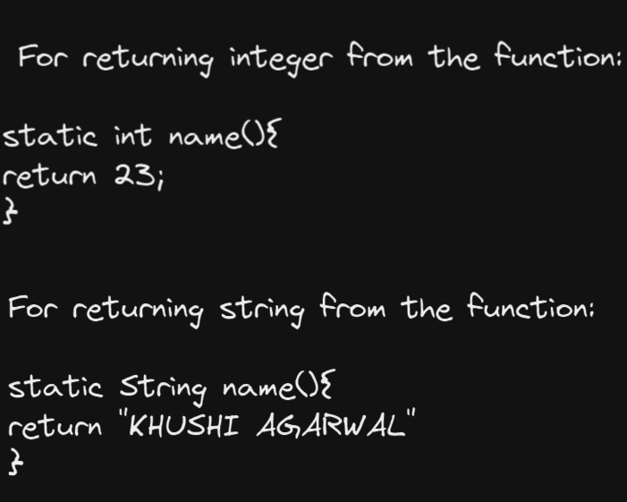
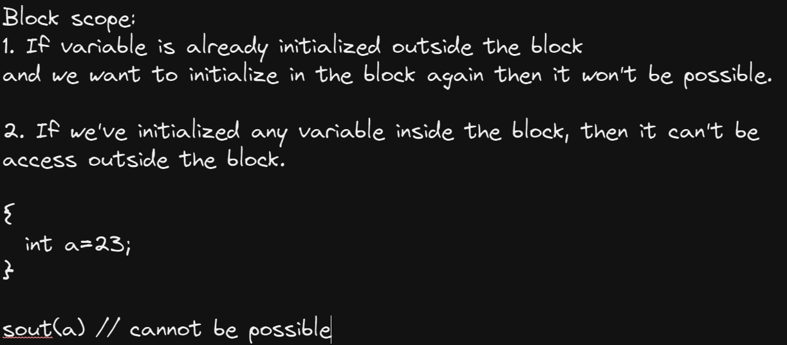
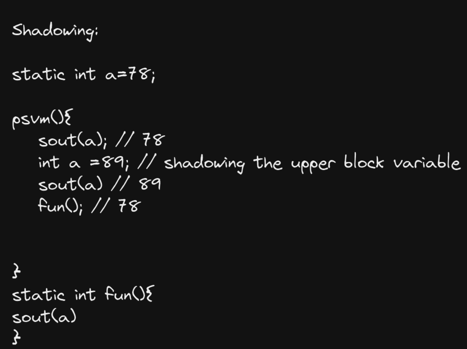
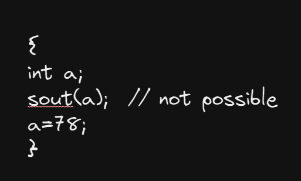

# **Functions/Methods**

Block of code which performs some functionality multiple times and can be reuse anywhere throughout the program

Functions should be static in order to use them in main function which is of static type as well

## Return Types:

syntax: 

## Arguments:

Passing arguments inside the functions and not compusory to have the same name as variables passed as parameters.

In java we just have a concept of "Pass by value"
not of pass by address or pass by reference

* When we pass the primitive data types to the function they doesn't reflect the changes in the main function.

* But when we pass the objects to the function, then their change will gets reflect in the main function.

## Scope:
1. Function scope: The scope which having accessibilty of variables inside the function only

2. Block scope: The scope which having the accessibility of variables within the block only

Changes inside the block will also reflect outside the function if the initialization is done outside the block even!

You cannot use object dependent things in object independent thing

## Shadowing: 
Lower block variable with the same name hides the upper block variable called shadowing

Note: Scope is begin when value is initialized

